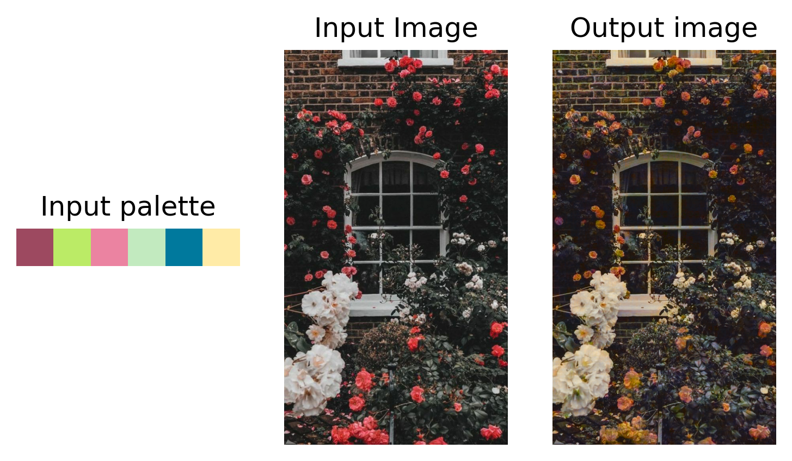
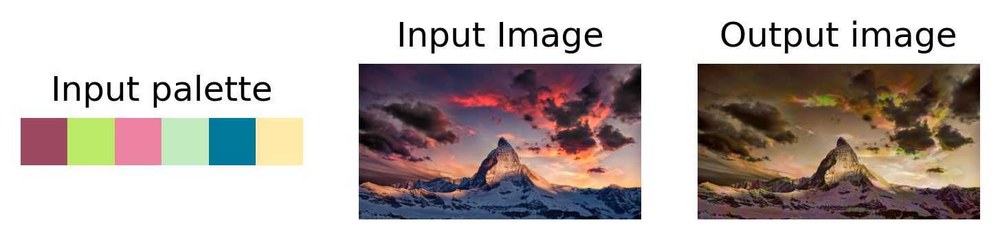
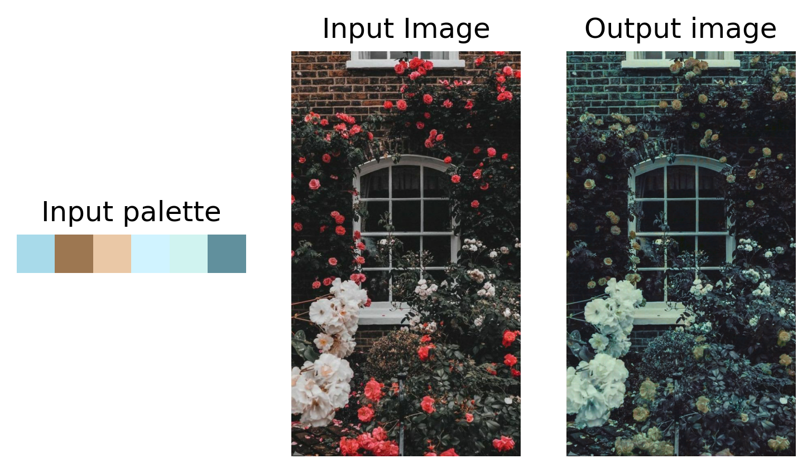
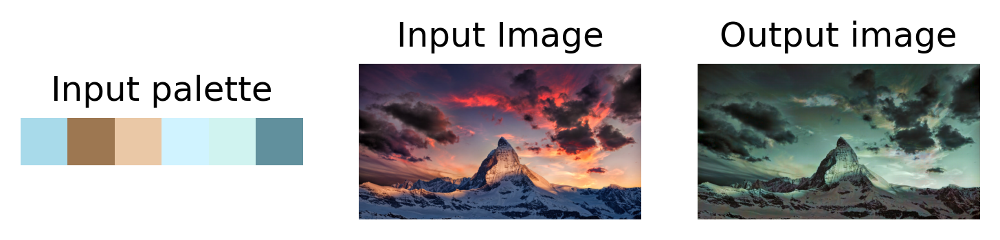

# PaletteNet-Implementation

This project was built as a part of the **RESCON** event hosted by SRM Machine Intelligence Community, in which we were asked to implement a research paper. Our team Phoneix choose **PaletteNet**: Image Recolorization with Given Color Palette", by Junho Cho, Sangdoo Yun, Kyoungmu Lee and Jin Young Choi.

PaletteNet is a deep neural network, which recolors an image according to a given target color palette. This takes two inputs a source image to be re-colored and a target palette. Human experts with a commercial software take on average 18 minutes to recolor an image, while PaletteNet automatically recolors plausible results in less than a second.

## 1. How we implemented it?
We created our own dataset since this task requires both source image and corresponding palette. We scrapped `1043` high-quality images from "https://www.design-seeds.com". This created a raw dataset of `1.1GB` which was stored on **AWS S3**.

## 2. Pre-processing
1. Cropping-As the source image and palette are attached we first need to separate them and then resize the image to `384,286`.
2. Hue-Shift-To train the model we created `20` variants of the image using the algorithm shown below. 

```
RGB -> LAB and cache L 
RGB -> HSV --hue shift--> H*SV -> LAB
Final hue-shifted image: LA∗B∗
```
After the pre-processing the size of the dataset increased to `20540` images and it occupied `3.1` GB of space.

## 3. Model

=======

* Our model is divided into three parts: Feature Encoder, Recoloring Decoder and Discrimantor.
* Feature Encoder is made up of ResNet blocks which extracts the content feature to a tensor of size [512x25x16]. 
* Recoloring Decoder takes the target palette and content features as the input and outputs the final recolored image.


## Training:

There are two phases of training:
* In the first phase, we train FE+RD using Euclidean loss
* In the second phase, we use a discriminator to differentiate between original images( no hue-shift ) and generated images. 
* We are using the Adam optimizer with β1=`0.5`, lr=`0.0002` and batch-size=`12`.


## Testing:

We visually compare the generated and expected *'a'* and *'b'* components. 


## Problems we faced:
* We were not provided with any sort of dataset.
* The paper did not describe the data preparation pipeline, only the algorithm.
* The training process was quite daunting because of two separate training loops and tools we had to make for visualization.

## Results:











## THANK YOU!
